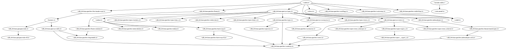

# depgraph

This is a dependency graph generator that works by parsing the output of the C
Preprocessor. This doesn't have much practical value, but it can be used to
generate visual representations of dependencies, which is fun. The graphs aren't
always perfect, especially when looking at system dependencies.

## Example

Let's say you have a file `include-stdlib.c`:

```
#include <stdlib.h>
```

You can generate an SVG of the dependencies of `stdlib.h` like this:

```
./depgraph --track-system --pretty-dot include-stdlib.c | dot -Tsvg > stdlib.svg
```

Something this project taught me is how sprawling system header dependencies
can be. On my Linux computer, this is the graph the above command generates:


(You may notice that the dependency of `include-stdlib.c` is misdetected here.)

## Performance

Because different `#include`s of a file may produce different results depending
on context, the program has to look at the dependencies of each file over and
over again. This makes it a bit slow. It has been sped up using multiple
processes.
